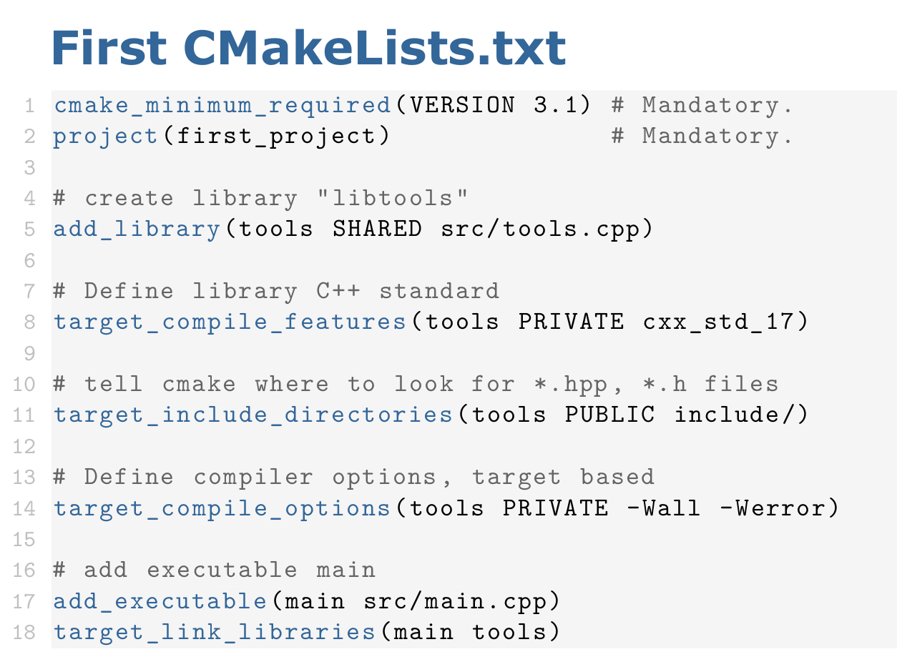

# Homework 1: Visualizing PointClouds with Open3D

To complete this assignment, follow the steps outlined below:

## Step 1: Downloading Homework Files

1. Download the homework files available on `homework_1.zip`.

## Step 2:  Extracting Files

2. unzip the 'homework_1.zip' file.
3. After extracting you have the file structure as
```
cpp-homeworks
|-- homework_1
|   |-- app
|   |   `-- main.cpp
|   |-- data
|   |   `-- pointcloud.ply
|   |-- my_viewer
|   |   |-- my_viewer.cpp
|   |   `-- my_viewer.hpp 
|   |-- CMakeLists.txt
|   `-- .gitignore
```

## What are the files in folder and what are you suppose to do?

'app': has main.cpp code which utilises the library to view the point cloud

'data': is a set of data points in a 3D coordinate system

'my_viewer': has libraries to visualize the pointcloud

'CMakeLists': builds the project

## Purpose of this assignment!

To build libraries using cmake 
`

# Let's get started with Tasks as described in `homework_1.pdf`

## Task 1: Install Open3D 

Download Open3D binaries based on your requirements. For Ubuntu 20.04.6 LTS, download from [here](https://github.com/isl-org/Open3D/releases/download/v0.18.0/open3d-devel-linux-x86_64-cxx11-abi-0.18.0.tar.xz) and rename the extracted folder to "open3d" in the `homework_1` folder.

## Task 2: Write Build System Generator using CMake

Ensure you have CMake installed (`cmake` command available in terminal).



### Steps to Build Library (as shown in the image)

Edit the `CMakeLists.txt` as follows:

```cmake
add_library (my_viewer SHARED ${CMAKE_CURRENT_SOURCE_DIR}/my_viewer/my_viewer.cpp)
```
Creating a library my_viewer, which is shared (DYNAMIC LIBRARY:The content in the library is loaded to memory at runtime, reused multiple times)

	
```
target_link_libraries (my_viewer PUBLIC Open3D::Open3D)
```

This command links the Open3D to the target my_viewwer. By this 'my_viewer' will utilize the Open3D functionalities and complier will include the Open3D components.

```
add_executable (main ${CMAKE_CURRENT_SOURCE_DIR}/app/main.cpp)
```
 
This command will compile 'main.cpp' into executable binary named "main"(it is given by you not necessary to be main ypu can change the name).Creating executable allows you to run and execute the funcatonalities which are defined in the main.cpp

```
target_link_libraries(main PRIVATE my_viewer)
```
   
Ensures the necessary libraries are linked to the executable. 

```
target_include_directories (main PUBLIC ${CMAKE_CURRENT_SOURCE_DIR})
```

Specifies where CMake should look for header files, ensuring that they are included during compilation


Include above commands to the CMakeLists.txt


## Task2.2 BUILD

Goto terminal cd homework_1
```
cmake -Bbuild .
```
```
cmake --build build
```

if there is warning

warning: libc++.so.1, needed by ../open3d/lib/libOpen3D.so, not found (try using -rpath or -rpath-link)
   
```
-sudo apt install libc++-dev
```
it installs necessary libraries. Repeat command 

```
cmake --build build
```


## Task3 Visualize a real PointCloud
view the pointcloud.ply
   
```
./main ../data/pointcloud.ply
```


